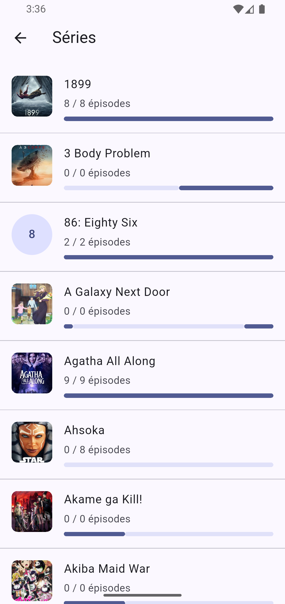
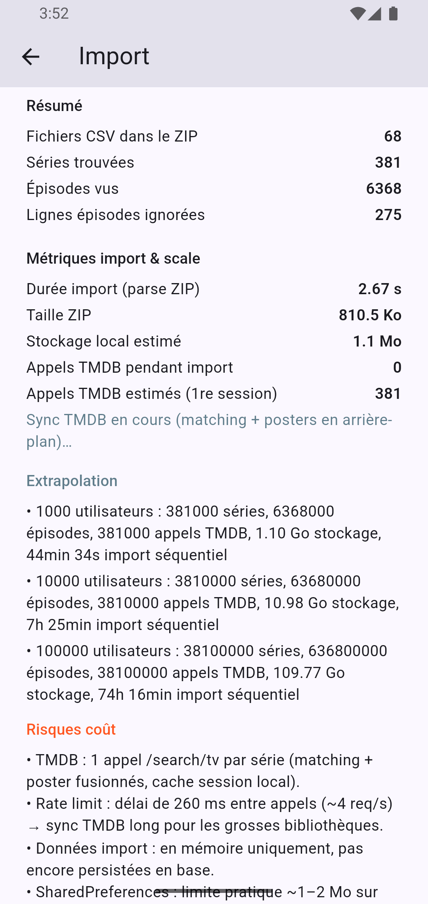
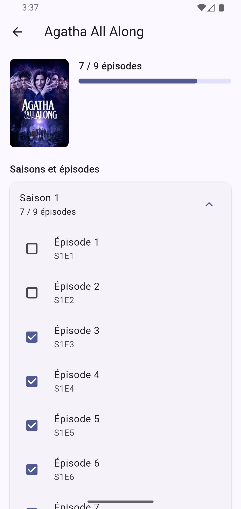

# TV Tracker

A **Flutter technical prototype** exploring how to migrate personal viewing history from a TV Time data export into a lightweight series tracker.

> **Status:** prototype / work in progress. This project was built to validate data import, matching and persistence strategies rather than to ship a finished consumer application.

## Prototype preview

### Imported library

<p align="center">
  
</p>

The imported library combines TV Time viewing data with TMDB metadata and locally tracked episode progress.

## What it explores

- Importing a **TV Time GDPR export** from local files
- Parsing and normalizing exported series and episode data
- Matching imported shows against **TMDB**
- Handling ambiguous matches with manual overrides
- Persisting match decisions and local watch state
- Caching poster information locally
- Tracking import and API metrics to reason about scalability
- Organizing the application with a lightweight feature-oriented Flutter structure

## Technical highlights

The project focuses more on data handling and application structure than visual polish.

- **Flutter + Dart**
- **Riverpod** for application state
- Feature-oriented structure under `lib/features`
- Separate shared concerns under `lib/core`
- **TMDB API** integration for show metadata and matching
- ZIP/file import using `file_picker` and `archive`
- Lightweight local persistence with `shared_preferences`
- Environment-based API configuration
- Unit tests around import parsing, matching, cache/persistence and metrics

## More screenshots

### Import diagnostics and scale estimates

<p align="center">
  
</p>

The prototype exposes import metrics and rough scale estimates to make API, storage and processing trade-offs visible while experimenting with the migration pipeline.

### Episode tracking

<p align="center">
  
</p>

Series details combine TMDB metadata with imported and locally editable watch state.

## Project structure

```text
lib/
├── app/
├── core/
│   ├── config/
│   ├── constants/
│   ├── metrics/
│   ├── theme/
│   └── utils/
└── features/
    ├── home/
    ├── import/
    ├── matching/
    ├── shows/
    └── tracker/
```

The structure stays intentionally lightweight: feature layers are introduced only where they are useful instead of forcing the same architecture onto every part of the prototype.

## Tests

The test suite currently covers several parts of the prototype, including:

- TV Time export parsing and importing
- TMDB show matching
- Manual match overrides
- Poster-cache persistence
- Watch-state persistence
- Tracker behaviour
- Import and API metrics

Run the tests with:

```bash
flutter test
```

## Local setup

### Requirements

- Flutter with a Dart SDK compatible with `^3.12.2`
- A TMDB API key

### Environment

Copy the example environment file:

```bash
cp .env.example .env
```

Then provide your TMDB key:

```env
TMDB_API_KEY=your_key_here
```

The real `.env` file is ignored by Git and should not be committed.

### Run

```bash
flutter pub get
flutter run
```

## Scope

TV Tracker is intentionally presented as a **technical prototype**, not a completed TV-tracking product. The current value of the project is in the import pipeline, matching logic, local persistence, API integration and testable Flutter structure.
